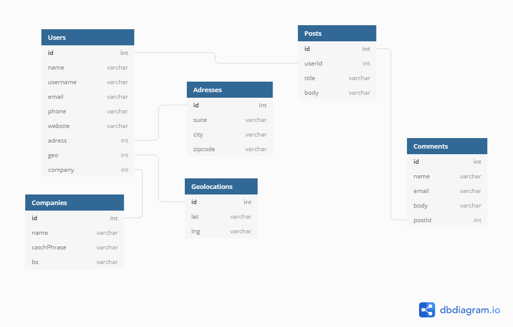

# Requirements
- Docker
- Docker-compose
- Node

# About solution

Frontend has been deployed using Netlify. Check it out [here](https://recruitment-blog-app.netlify.com)
Solution hasn't been done because there was't time enough. However here are done system elements:
- Implemented prototypes
- Calling to API from example
- Deploy Frontend into netlify
- Configure eslint
- Use React-Redux
- Use Redux-Thunk
- Validating forms in frontend
- Prepare Dockerfiles and docker-compose for future development (some integration tests, CI/CD etc.)
- Prepare backend app. You can call test endpoint but there wasn't business logic and connection with database
- Preapre MySQL Schema
- Prepare Initializing script (better idea is use Sequelize but I couldn't use frameworks)

# How to run

## Docker (doesn't works at all)
1. Go to root file
2. Use `docker-compose down -v --rmi all --remove-orphans` to run whole app. This command makes remove all images and all things after `docker-compose down`. Alternatively you can use just `docker compose up`.
3. Go to `localhost:3000`. (Check your docker machine ip, it can be different depends on your operating system)

## Local

### Before
1. Go to `/database` catalog and build database image using `docker build -t blogAppDb .`

### Frontend
1. Go to `/frontend` catalog
2. Run `npm start` to run application
3. Wait for compiling and check `localhost:3000` if app works

### Backend (doesn't finished)

1. Go to `/backend` catalog
2. Run `npm start` to run application
3. Wait for compiling and check `localhost:4000` if app works

# Database schema
